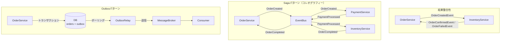

# マイクロサービス連携パターン サンプルコード集

マイクロサービスアーキテクチャにおけるサービス間連携の主要パターンを Go で実装したサンプルコード集です。

## 収録パターン

| パターン | ディレクトリ | 概要 |
|---|---|---|
| 結果整合性 | [`eventual-consistency/`](./eventual-consistency/) | サービスが非同期で通信し、最終的に整合性を持つ |
| Saga | [`saga/`](./saga/) | 分散トランザクションをイベント連鎖で実現し、失敗時に補償トランザクションを実行 |
| Outbox | [`outbox/`](./outbox/) | DBへの書き込みとイベント発行を原子的に保証する |

## 全体像



## 実行方法

```bash
# 結果整合性
go run ./eventual-consistency/

# Sagaパターン
go run ./saga/

# Outboxパターン
go run ./outbox/
```

## 動作環境

- Go 1.21 以上
- 外部依存なし（標準ライブラリのみ）

## パターン比較

| 観点 | 結果整合性 | Saga | Outbox |
|---|---|---|---|
| 主な目的 | 非同期での最終整合 | 分散トランザクション | 確実なイベント配信 |
| 失敗時の対処 | リトライ / 補正処理 | 補償トランザクション | リレーが再送 |
| 複雑さ | 低 | 中〜高 | 中 |
| 組み合わせ | — | Outboxと併用推奨 | Sagaと併用推奨 |

> Outbox パターンは Saga パターンと組み合わせて使うことが多い。
> Saga でイベントを発行する際に Outbox を使うことで、イベント配信の信頼性を高める。
