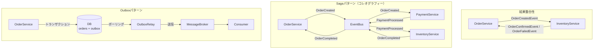

# マイクロサービス連携パターン サンプルコード集

マイクロサービスアーキテクチャにおけるサービス間連携の主要パターンを Go で実装したサンプルコード集です。

## 収録パターン

理解しやすい順に並べています。詳しい関係性は [`docs/patterns-relationship.md`](./docs/patterns-relationship.md) を参照してください。

| 順 | パターン | ディレクトリ | 概要 |
|---|---|---|---|
| 1 | 結果整合性 | [`eventual-consistency/`](./eventual-consistency/) | サービスが非同期で通信し、最終的に整合性を持つ（全体の前提となる概念） |
| 2 | Outbox | [`outbox/`](./outbox/) | DBへの書き込みとイベント発行を原子的に保証する（Sagaの基盤インフラ） |
| 3 | Saga | [`saga/`](./saga/) | 分散トランザクションをイベント連鎖で実現し、失敗時に補償トランザクションを実行 |

## 全体像



## 実行方法

```bash
# 1. 結果整合性（概念の確認）
go run ./eventual-consistency/

# 2. Outboxパターン（基盤インフラの確認）
go run ./outbox/

# 3. Sagaパターン（応用パターンの確認）
go run ./saga/
```

## 動作環境

- Go 1.21 以上
- 外部依存なし（標準ライブラリのみ）

## パターン比較

| 観点 | 結果整合性 | Outbox | Saga |
|---|---|---|---|
| 位置づけ | 設計の前提・制約 | 基盤インフラ | 応用パターン |
| 主な目的 | 非同期での最終整合 | 確実なイベント配信 | 分散トランザクション制御 |
| 失敗時の対処 | リトライ / 補正処理 | リレーが再送 | 補償トランザクション |
| 複雑さ | 低 | 中 | 中〜高 |
| 組み合わせ | 全体の前提 | Sagaと併用推奨 | Outboxと併用推奨 |

> Outbox → Saga の順で理解するとスムーズ。Outbox は Saga のイベント発行の信頼性を支える基盤。
> 各パターンの関係性の詳細は [`docs/patterns-relationship.md`](./docs/patterns-relationship.md) を参照。
