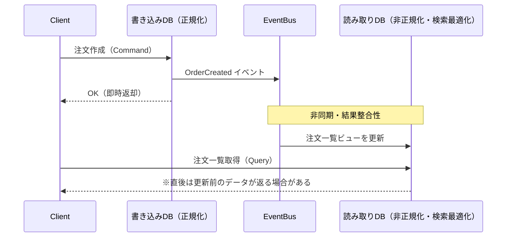
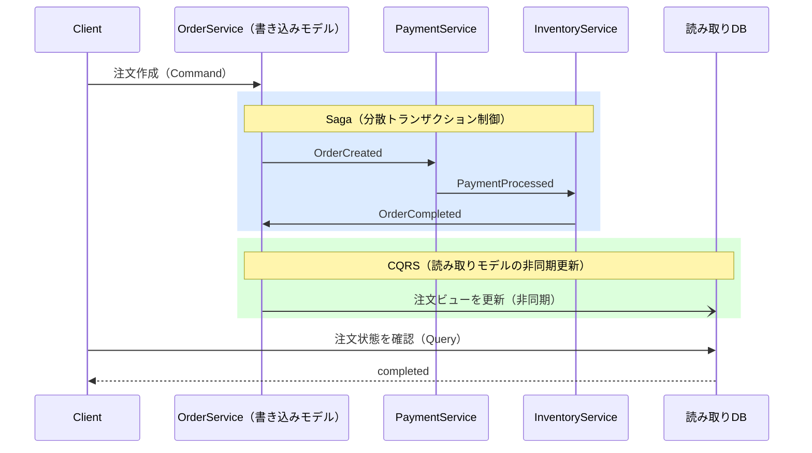
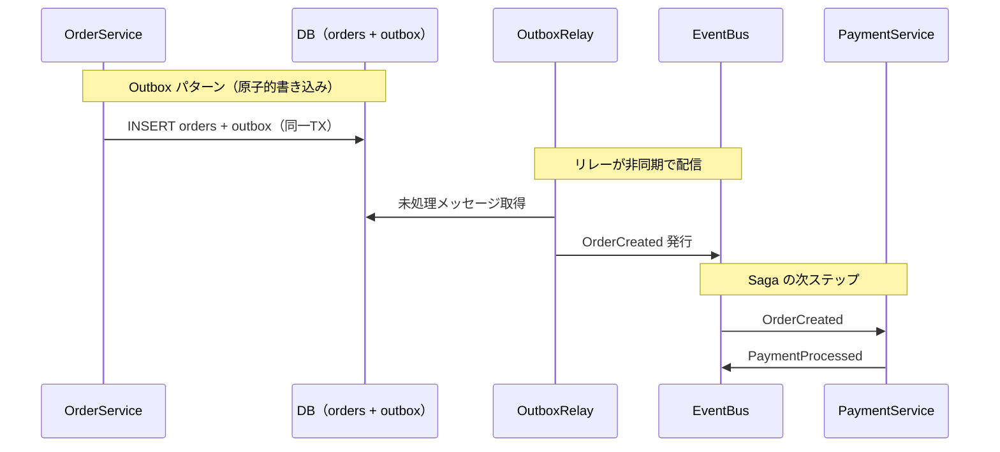

# マイクロサービス連携パターンの関係性

## パターン同士の位置づけ

このリポジトリで扱う3パターン＋CQRSは、それぞれ独立したパターンではなく、**階層的な依存関係**を持っています。

```
┌─────────────────────────────────────────────────────────┐
│               結果整合性（設計上の前提・制約）               │
│                                                         │
│  ┌─────────────┐    ┌──────────────┐                   │
│  │    CQRS     │    │     Saga     │  ← 応用パターン     │
│  │（読み書き分離）│    │（分散TX制御） │                   │
│  └──────┬──────┘    └──────┬───────┘                   │
│         │                  │                           │
│         └────────┬─────────┘                           │
│                  ↓                                     │
│           ┌──────┴──────┐                             │
│           │   Outbox    │  ← 基盤インフラ               │
│           │（配信信頼性） │                             │
│           └─────────────┘                             │
└─────────────────────────────────────────────────────────┘
```

| パターン | 役割 | 位置づけ |
|---|---|---|
| **結果整合性** | 「即時整合性は不要、最終的に整合すればよい」という設計判断 | 全体の前提・制約 |
| **Outbox** | DB書き込みとイベント発行を原子的に保証する | 基盤インフラ |
| **CQRS** | 読み書きモデルを分離し、非同期で読み取りモデルを更新する | 応用パターン（結果整合性を前提に成立） |
| **Saga** | 複数サービスにまたがる分散トランザクションを補償トランザクションで制御する | 応用パターン（Outboxと組み合わせて使うことが多い） |

---

## 結果整合性 と CQRS の関係

**CQRS は結果整合性の"実現手段"として非常に相性が良い。**

CQRS では書き込みモデルと読み取りモデルを分離し、書き込みイベントを非同期で読み取りモデルに反映します。
この「非同期反映」の部分がそのまま結果整合性になります。



### ポイント

- 書き込み直後に Query すると「古いデータ」が返る可能性がある
- これを**許容できる設計**だからこそ CQRS が成立する
- 許容できない場合（例：決済直後に残高を表示するなど）は、書き込みモデルから直接読む設計にする

---

## CQRS と Saga の関係

**排他ではなく、普通に併用する。** 役割が異なるため。

- **Saga** → サービス間の分散トランザクション制御（書き込みの整合性）
- **CQRS** → 読み書きモデルの分離（読み取りのスケーラビリティ・最適化）



---

## Outbox と Saga の関係

**Outbox は Saga のイベント発行を信頼性高くするための基盤。**

Saga では各ステップでイベントを発行しますが、「DBに書き込んだがイベントは未送信」という状態が発生しうます。
Outbox を組み合わせることでこの問題を解消できます。



### Outbox なしで Saga を動かすリスク

```
1. OrderService: DBに注文を保存     ← 成功
2. OrderService: EventBusにイベント発行 ← ここでクラッシュ！
→ 支払いサービスにイベントが届かず Saga が途中で止まる
```

Outbox を使えば、クラッシュ後に再起動した OutboxRelay が未送信イベントを拾って再送するため、Saga が継続される。

---

## 推奨する学習・理解の順序

依存関係を踏まえると、以下の順で理解するとスムーズです。

```
1. 結果整合性     ← 「なぜ整合性が難しいか」という前提の理解
       ↓
2. Outbox        ← 「イベントを確実に届けるにはどうするか」という基盤
       ↓
3. Saga          ← 「複数サービスにまたがる処理をどう制御するか」
       ↓
4. CQRS          ← 「読み取りをどうスケールさせるか」（このリポジトリでは未実装）
```

現実のシステムでは、これらを組み合わせた全体像はこうなります。

```
Client
  │
  │ Command（書き込み）
  ▼
OrderService（書き込みモデル）
  │
  │ Outbox（原子的なイベント記録）
  ▼
OutboxRelay → EventBus
                │
                │ Saga（PaymentService, InventoryService と連携）
                ▼
            各サービスが処理完了後にイベントを発行
                │
                │ CQRS（読み取りモデルの非同期更新）
                ▼
            ReadModel（非正規化されたビュー用DB）
                ▲
                │ Query（読み取り）
              Client
```
