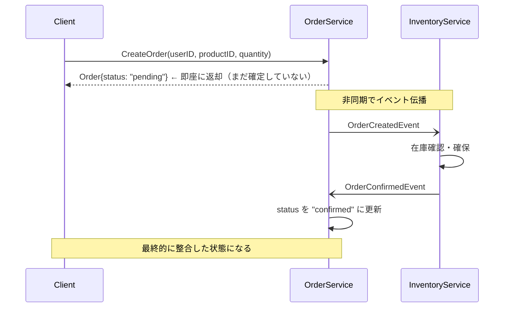
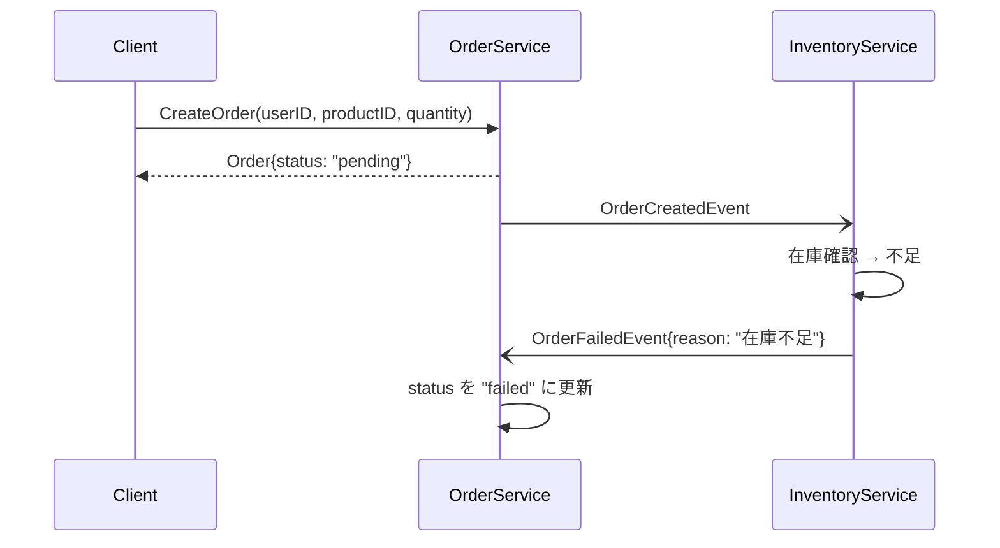

# 結果整合性パターン (Eventual Consistency)

## 概要

**結果整合性**とは、分散システムにおいて「即時の整合性は保証しないが、最終的には整合した状態になる」という設計原則です。

マイクロサービスでは、各サービスが独立したデータベースを持つため、複数サービスにまたがる操作を単一トランザクションで完結させることができません。結果整合性はこの制約に対する現実的な解法です。

## このサンプルの構成

注文サービス（OrderService）と在庫サービス（InventoryService）が非同期で通信し、注文の最終状態が決まる様子を示します。

```
eventual-consistency/
├── order_service.go     # 注文の作成・状態管理
├── inventory_service.go # 在庫の確認・確保
└── main.go              # デモシナリオの実行
```

## シーケンス図

### 正常フロー（在庫あり）



### 失敗フロー（在庫不足）



## 実装のポイント

### 1. 注文はすぐに `pending` で返す

```go
func (s *OrderService) CreateOrder(userID, productID string, quantity int) Order {
    order := Order{
        Status: StatusPending, // 即時返却、まだ確定しない
        ...
    }
    // イベントを非同期で発行
    s.OrderCreatedCh <- OrderCreatedEvent{...}
    return order // pending のまま返す
}
```

クライアントは注文が受け付けられたことだけを知り、最終的な成否は後から確認します。

### 2. 在庫サービスが非同期で処理

```go
func (s *InventoryService) ListenAndProcess(ctx ...) {
    for event := range s.orderCreatedCh {
        if s.stock[event.ProductID] >= event.Quantity {
            // 在庫確保 → 確定イベントを送信
            s.orderSvc.OrderConfirmedCh <- OrderConfirmedEvent{...}
        } else {
            // 在庫不足 → 失敗イベントを送信
            s.orderSvc.OrderFailedCh <- OrderFailedEvent{...}
        }
    }
}
```

### 3. 注文サービスが状態を更新

```go
func (s *OrderService) ListenForStatusUpdates(ctx ...) {
    select {
    case event := <-s.OrderConfirmedCh:
        s.updateStatus(event.OrderID, StatusConfirmed)
    case event := <-s.OrderFailedCh:
        s.updateStatus(event.OrderID, StatusFailed)
    }
}
```

## 実行

```bash
go run ./eventual-consistency/
```

### 出力例

```
注文作成直後のステータス: orderID=order-1, status=pending (まだpending)
...（非同期処理）...
最終状態: orderID=order-1, status=confirmed  ← 最終的に確定
```

## 注意点・トレードオフ

| メリット | デメリット |
|---|---|
| 高可用性（サービスが独立して動作） | 即時整合性がない |
| 疎結合（サービスが互いを知らなくてよい） | 読み取り時に古いデータを返す可能性がある |
| スケールしやすい | 失敗時の補正処理が必要 |

## 関連パターン

- **Saga パターン**: 複数ステップにわたる処理で補償トランザクションが必要な場合
- **Outbox パターン**: イベント発行の信頼性を高めたい場合
