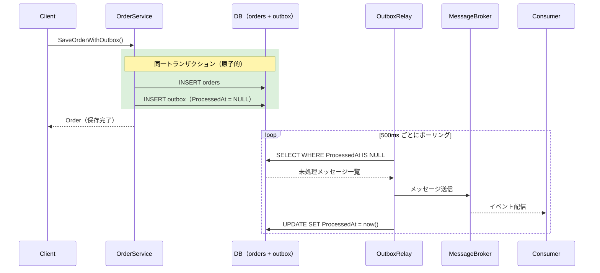
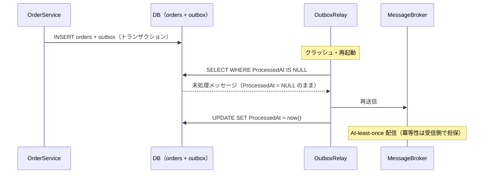

# Outbox パターン

## 概要

**Outbox パターン**は、データベースへの書き込みとメッセージブローカーへのイベント発行を**原子的に**保証するパターンです。

### 解決する問題

マイクロサービスでよくある「二重書き込み問題」を解決します。

```
❌ 問題のある実装
1. DBに注文を保存  ← 成功
2. メッセージを送信 ← ここでクラッシュ！
→ DBには注文があるのにイベントは届かない（データ不整合）

✅ Outbox パターン
1. DBに注文 + Outboxメッセージを同一トランザクションで保存
2. OutboxRelay が定期的にポーリングして送信
→ クラッシュしても再起動後にリレーが未送信メッセージを配信する
```

## このサンプルの構成

```
outbox/
├── order_service.go  # 注文サービス（DB・Outboxテーブルの同時書き込み）
├── outbox_relay.go   # OutboxRelay（ポーリング → ブローカーへ送信）
└── main.go           # デモシナリオの実行
```

## シーケンス図

### 正常フロー



### 障害発生時（クラッシュ → 再送）



## 実装のポイント

### 1. DBへの原子的な書き込み

```go
func (db *InMemoryDB) SaveOrderWithOutbox(order *Order, msg *OutboxMessage) error {
    // BEGIN TRANSACTION 相当
    db.mu.Lock()
    db.outboxMu.Lock()
    defer db.mu.Unlock()
    defer db.outboxMu.Unlock()

    db.orders[order.ID] = order           // 注文を保存
    db.outbox = append(db.outbox, msg)   // Outboxメッセージを保存
    // COMMIT
    return nil
}
```

実際の実装では `BEGIN/COMMIT` のトランザクション内で `INSERT` します。どちらか一方が失敗すればロールバックされ、不整合が生じません。

### 2. OutboxRelay のポーリング

```go
func (r *OutboxRelay) poll() {
    messages := r.db.GetUnprocessedMessages() // ProcessedAt IS NULL
    for _, msg := range messages {
        if err := r.broker.Send(msg); err == nil {
            r.db.MarkAsProcessed(msg.ID) // 送信後にフラグを立てる
        }
    }
}
```

- 送信成功後に `ProcessedAt` を更新するため、クラッシュしても再送できる
- **At-least-once 配信**（少なくとも1回は届く）を保証
- 重複配信が発生しうるため、コンシューマー側で冪等性を担保する

### 3. OutboxMessage の構造

```go
type OutboxMessage struct {
    ID          string     // メッセージID
    AggregateID string     // 関連エンティティのID（OrderID など）
    EventType   string     // イベント種別（"OrderCreated" など）
    Payload     string     // JSONシリアライズされたイベントデータ
    CreatedAt   time.Time
    ProcessedAt *time.Time // nil = 未処理、値あり = 処理済み
}
```

## 実行

```bash
go run ./outbox/
```

### 出力例

```
[InMemoryDB] トランザクション完了: orderID=order-1, outboxID=outbox-2
[OutboxRelay] 未処理メッセージを検出: count=2
[OutboxRelay] メッセージを送信: outboxID=outbox-2, eventType=OrderCreated
[Consumer] メッセージを受信: payload={"order_id":"order-1",...}
[InMemoryDB] メッセージを処理済みにしました: outboxID=outbox-2

--- Outboxテーブルの最終状態 ---
Outbox: id=outbox-2, status=処理済み (17:58:55.157)
```

## 注意点・トレードオフ

| メリット | デメリット |
|---|---|
| DBとイベント発行の整合性を保証 | ポーリングによる遅延が発生（通常数百ms〜数秒） |
| サービス障害後も確実に配信 | DBにOutboxテーブルが必要 |
| 既存DBだけで実装可能（MQ不要） | At-least-once なのでコンシューマーの冪等性が必要 |

## CDC（Change Data Capture）との比較

Outboxのポーリング方式の代替として、DBのWAL（Write-Ahead Log）を監視する **CDC** アプローチもあります。

| 方式 | ポーリング（このサンプル） | CDC（Debezium等） |
|---|---|---|
| 遅延 | 数百ms〜数秒 | ほぼリアルタイム |
| 実装コスト | 低 | 高（外部ツール必要） |
| DB負荷 | ポーリングで発生 | WAL読み取り |

## 関連パターン

- **Saga パターン**: Saga のイベント発行に Outbox を組み合わせることで、信頼性を高められる
- **結果整合性**: Outbox は結果整合性を確実に実現するための基盤になる
