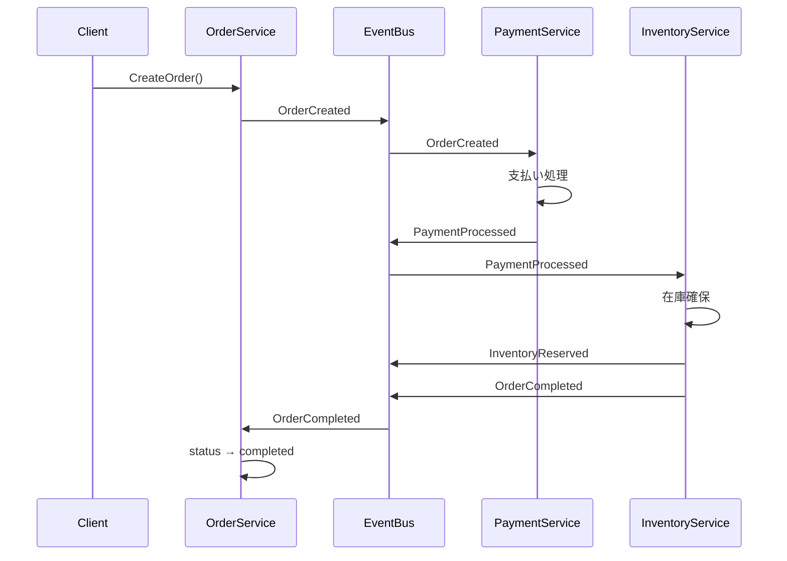
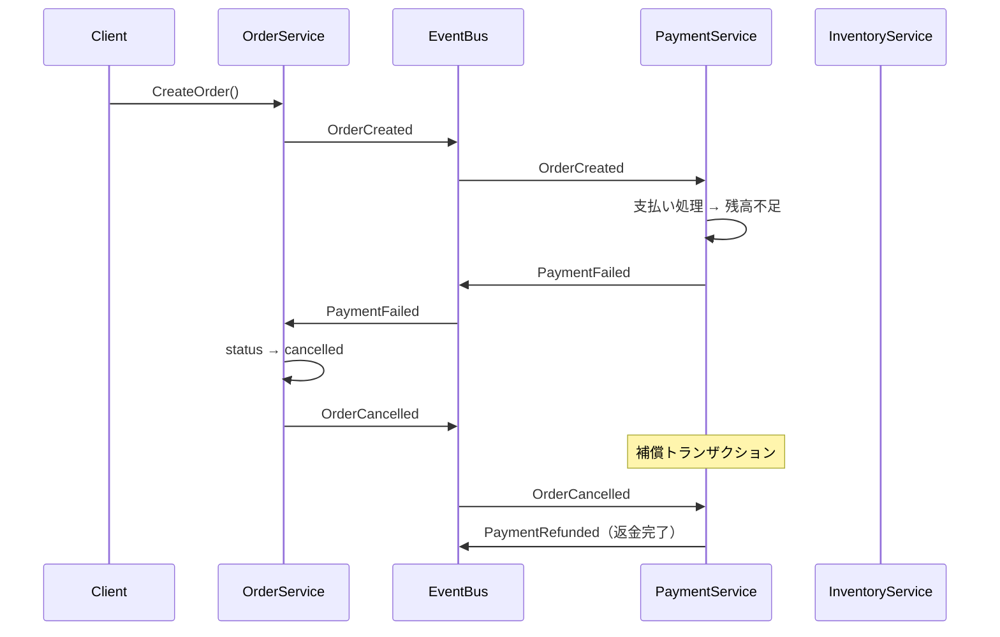
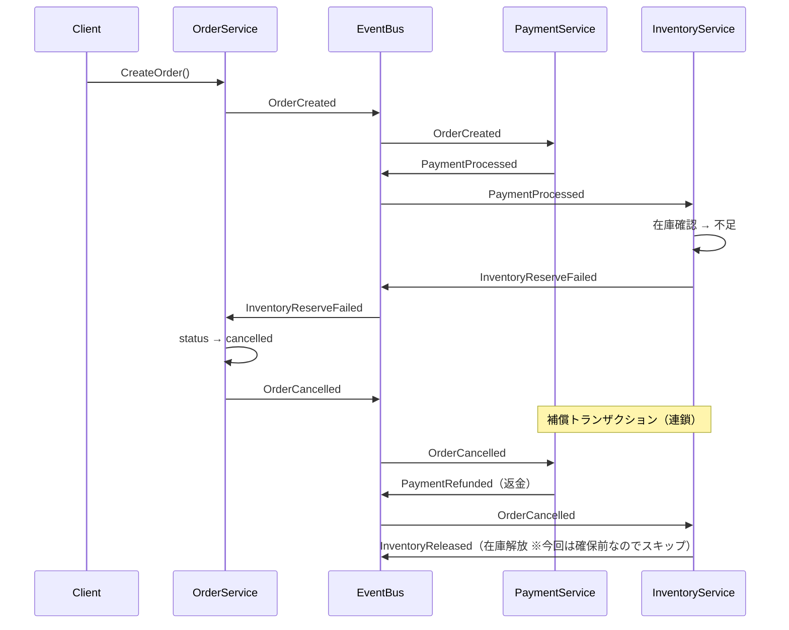

# Saga パターン（コレオグラフィー方式）

## 概要

**Saga パターン**は、複数のマイクロサービスにまたがる分散トランザクションを、一連のローカルトランザクションとイベントの連鎖で実現するパターンです。

### 2種類の Saga

| 方式 | 説明 | このサンプル |
|---|---|---|
| **オーケストレーション** | 中央の Saga オーケストレーターが各サービスに指示 | — |
| **コレオグラフィー** | 各サービスがイベントを発行・購読し、自律的に動作 | ✅ |

コレオグラフィー方式では、中央の管理者が不要な分、サービスの独立性が高まります。一方、処理フローが各サービスに分散するため、全体を把握しにくくなることがあります。

## このサンプルの構成

```
saga/
├── order_service.go     # 注文管理・EventBus・共通型定義
├── payment_service.go   # 支払い処理・補償（返金）
├── inventory_service.go # 在庫管理・補償（在庫解放）
└── main.go              # デモシナリオの実行
```

## イベント一覧

| イベント | 発行者 | 意味 |
|---|---|---|
| `OrderCreated` | OrderService | 注文が作成された（Saga の起点） |
| `PaymentProcessed` | PaymentService | 支払いが完了した |
| `PaymentFailed` | PaymentService | 支払いが失敗した |
| `InventoryReserved` | InventoryService | 在庫が確保された |
| `InventoryReserveFailed` | InventoryService | 在庫確保が失敗した |
| `OrderCompleted` | InventoryService | 注文が完了した |
| `OrderCancelled` | OrderService | 注文がキャンセルされた（補償トリガー） |
| `PaymentRefunded` | PaymentService | 返金が完了した（補償） |
| `InventoryReleased` | InventoryService | 在庫が解放された（補償） |

## シーケンス図

### 正常フロー



### 失敗フロー①：支払い失敗



### 失敗フロー②：在庫不足（支払い後）



## 実装のポイント

### EventBus（シンプルな pub/sub）

```go
type EventBus struct {
    mu          sync.RWMutex
    subscribers map[EventType][]chan Event
}

func (b *EventBus) Publish(event Event) {
    for _, ch := range b.subscribers[event.Type] {
        ch <- event // 全購読者に配信
    }
}
```

外部MQを使わず、Go チャンネルだけで pub/sub を実現しています。

### 補償トランザクションの連鎖

```
InventoryReserveFailed
  → OrderService が OrderCancelled を発行
    → PaymentService が PaymentRefunded を実行
    → InventoryService が InventoryReleased を実行（確保済みの場合）
```

`OrderCancelled` という1つのイベントが補償トランザクションのトリガーになり、各サービスが自律的に補正します。

## 実行

```bash
go run ./saga/
```

### 出力例

```
--- シナリオ1: 正常完了 ---
最終状態: orderID=order-1, status=completed

--- シナリオ2: 支払い失敗 ---
最終状態: orderID=order-2, status=cancelled

--- シナリオ3: 在庫不足（支払い後に補償） ---
PaymentRefunded（返金完了）
最終状態: orderID=order-3, status=cancelled
```

## 注意点・トレードオフ

| メリット | デメリット |
|---|---|
| サービスが独立してスケールできる | 処理フローが各サービスに分散し把握しにくい |
| 単一障害点がない | イベントの順序保証が必要になる場合がある |
| 補償トランザクションで整合性を担保 | デバッグ・テストが難しい |

## 関連パターン

- **結果整合性**: Saga は結果整合性を実現する手段の1つ
- **Outbox パターン**: Saga のイベント発行に Outbox を組み合わせると信頼性が向上する
